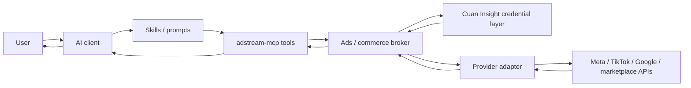

# Architecture

`adstream-mcp` is an MCP connector and data access layer for ads and commerce analytics. Its primary job is to connect AI clients to provider data and safe provider actions through small, generic, reusable tools.

The core rule is:

```text
MCP provides data; AI and skills provide reasoning.
```

The MCP core should not become the primary home for report logic, recommendation engines, benchmark scoring, or brand-specific audit workflows.

## System Boundary

| Layer | Owns | Does not own |
|---|---|---|
| AI client | User intent, narrative, recommendations, context adaptation | Provider authentication, raw API calls |
| Skills / prompts | Instructions, heuristics, report workflows, interpretation limits | Public MCP contracts, provider credentials |
| MCP server | Tool registration, input validation, normalized responses, safe action lifecycle | Brand strategy, benchmark policy, generated reports as first-class APIs |
| Broker | Credential resolution, provider routing, permission policy, normalized operation requests | Long-form analysis or recommendation ranking |
| Provider adapters | Provider-native API calls and mapping into canonical contracts | Public tool naming proliferation |
| Cuan Insight | Organization/workspace credential control plane and scoped token resolution | AI reasoning or report writing |

Skills are useful, but they are not part of the MCP core contract. They should explain how an AI should call generic tools, compare periods, select top/bottom entities, and state interpretation caveats.

## Data Flow



## Core Components

### MCP Tool Surface

The target public API is provider-agnostic and small:

- `ads_list_accounts`
- `ads_list_campaigns`
- `ads_get_performance`
- `ads_get_creatives`
- `ads_get_change_history`
- `ads_get_capabilities`
- `commerce_get_performance`

Optional write tools must stay separate from default read-only analytics:

- `ads_pause_campaign`
- `ads_resume_campaign`
- `ads_update_campaign_budget`
- `ads_rename_campaign`

### Broker

The broker translates canonical MCP requests into provider adapter calls. It is responsible for:

- resolving credentials without exposing tokens;
- routing requests by `provider`;
- enforcing read/write permission policy;
- normalizing provider output into stable response envelopes;
- returning warnings, paging metadata, data freshness, and capability information.

### Provider Adapters

Adapters may use provider-native terms internally, such as Meta `adAccountId` or TikTok `advertiserId`, but those terms should not leak into new public MCP contracts unless there is no normalized equivalent.

Provider-specific extensions should be explicit and documented. A generic `params: Record<string, unknown>` path should be reserved for narrow escape hatches, not the main API.

### Cuan Insight Credential Layer

Cuan Insight stores organization-rooted connection keys and provider credentials. `adstream-mcp` resolves scoped credentials at runtime, then calls provider APIs directly. The MCP layer must remain client-agnostic and should not assume a Claude-only workflow.

## Non-Goals for MCP Core

The MCP core should not add first-class tools for:

- daily report generation;
- weekly report generation;
- creative audit narratives;
- recommendation ranking;
- KPI scoring;
- benchmark engines;
- top/bottom content reports.

Those are AI/skill responsibilities built on top of canonical data tools.

## Write Operation Boundary

Write operations are opt-in, scoped, and isolated from analytics tools. They must follow the write safety contract in `docs/WRITE_SAFETY_CONTRACT.md`:

- permission check;
- dry-run preview;
- explicit confirmation;
- exact execution;
- sanitized audit result.

No analytics tool should mutate provider state.
